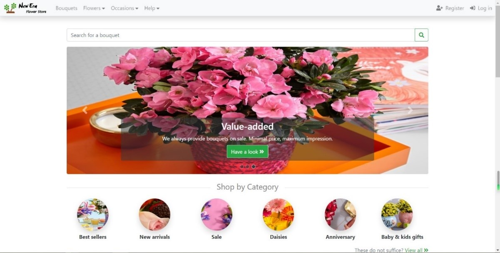
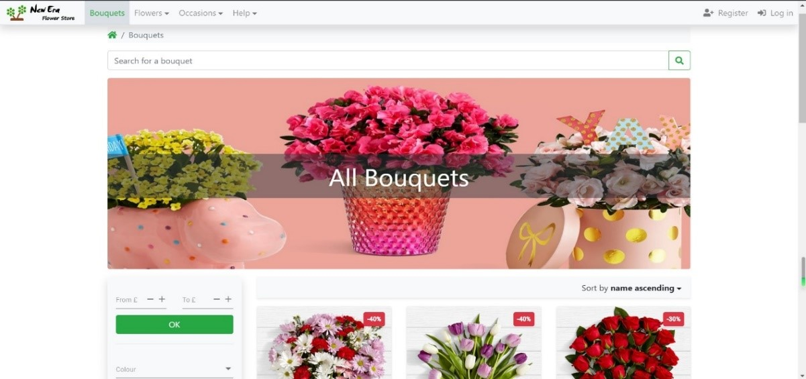
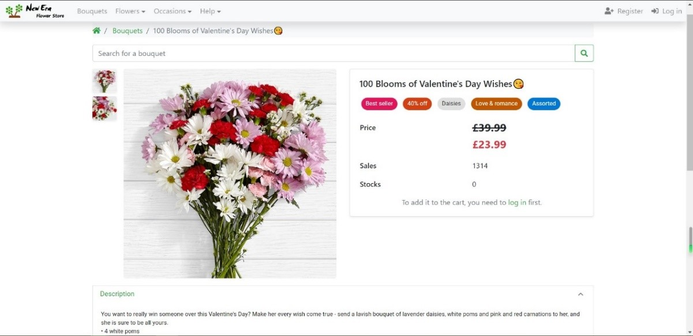
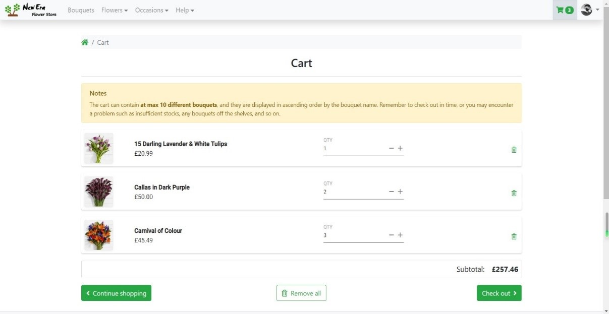
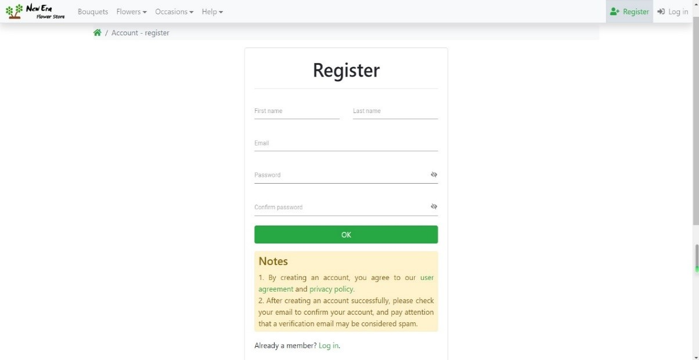
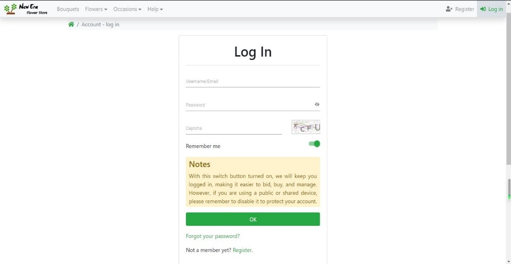
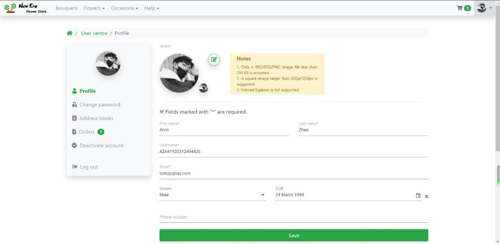
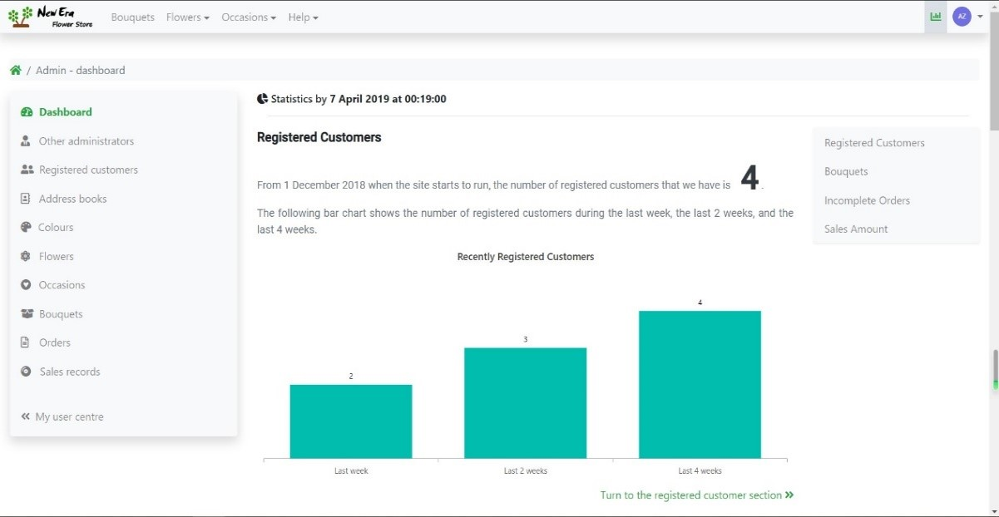
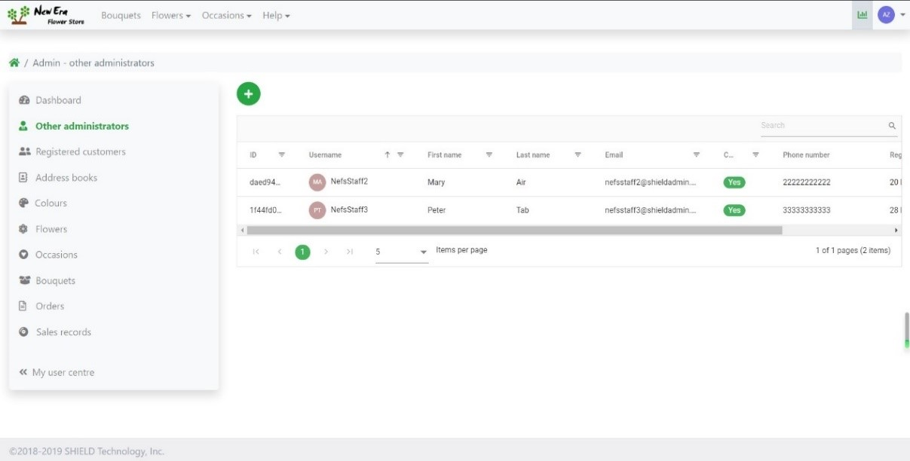
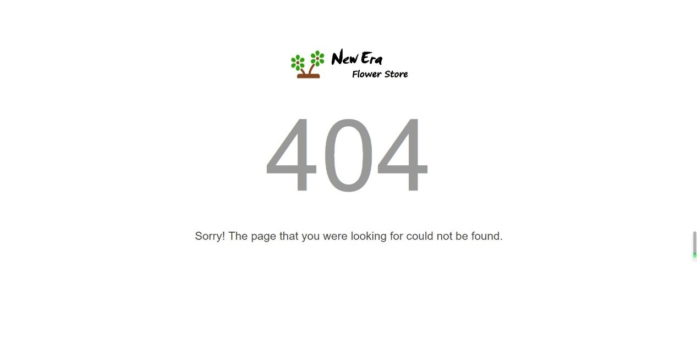

# [BUAAHND_G3T2_GU2](https://github.com/ArvinZJC/BUAAHND_G3T2_GU2)/NewEraFlowerStore

This project is named as **New Era Flower Store** which contains a simplified online flower store sales management system based on web developed by me as the final assignment of the course **Graded Unit 2**  during Term 2 of Grade 3 in BUAA HND. It must be admitted that although I worked hard on developing a system close to these commercial ones, I still have a long way to go.

## Partial UI

Figure 1
Figure 2
Figure 3
Figure 4
Figure 5
Figure 6
Figure 7
Figure 8
Figure 9
Figure 10

## ATTENTION

| Name | Version |
| :-- | :--: |
| ASP.NET Core | 2.2.5 |
| MySQL | 8.0.15 |
| Bootstrap | 4.3.1 |
| Fontawesome (Free) | 5.6.3 |
| jQuery | 3.3.1 |
| jQuery Validation | 1.19.0 |
| Microsoft.jQuery.Unobtrusive.Validation | 3.2.11 |
| Syncfusion Essential JS2 | 17.1.0.48 |

Table 1

1. By 25 May 2019, the versions of main components in the application had been listed in Table 1.
2. In order to make MySQL support storing data containing emoji (😂, 😊, 😘, etc.), MySQL needs configuring. There is a web page showing how to do this: <https://www.cnblogs.com/lurenjiashuo/p/mysql-emoji.html>.
3. When debugging in the development environment, the application will initialise data in the database (NewEraFlowerStore\Data\DbInitialiser.cs), each time it starts. This includes administrator data, customer data, colour data, flower data, occasion data, bouquet data, and sales record data. The following are accounts for test purposes:
   * (Administrator) NefsStaff1/nefsstaff1@shieldadmin.com, nefsstaff1
   * (Administrator) NefsStaff2/nefsstaff2@shieldadmin.com, nefsstaff2
   * (Administrator) NefsStaff3/nefsstaff3@shieldadmin.com, nefsstaff3
   * (Customer) TestCustomer1/testcustomer1@nefs.com, testcustomer1
   * (Customer) TestCustomer2/testcustomer1@nefs.com, testcustomer2
   * (Customer) TestCustomer3/testcustomer1@nefs.com, testcustomer3

For more info on the project, turn to the relevant reports.